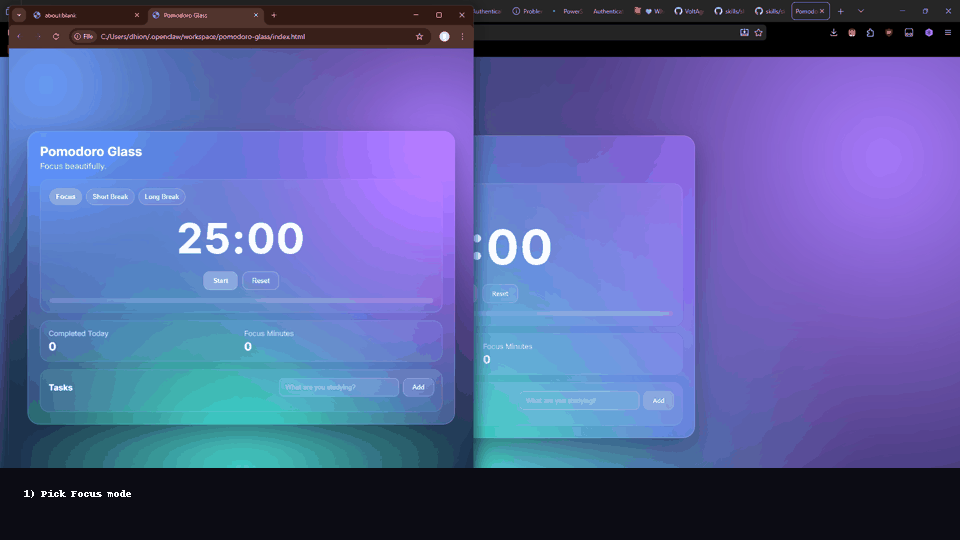

# ✨ Pomodoro Glass

A **clean, liquid-glass Pomodoro web app** built for focused deep work.

> Focus beautifully. Study intentionally. Repeat consistently.



## ⚡ Why this app

Most timers are either too plain or too noisy.
**Pomodoro Glass** aims for the middle:
- calming visual design
- simple controls
- fast keyboard flow
- local persistence (no account needed)

## 🧠 Features

- Focus / Short Break / Long Break modes
- Start / Pause / Reset controls
- Progress bar + document title timer
- Completed sessions + focus minutes stats
- Task list (add / done / delete)
- Browser notifications when a session ends
- Keyboard shortcuts:
  - `Space` → Start/Pause
  - `R` → Reset

## 🏗️ Architecture (SOLID-leaning)

The app is modularized for maintainability:

```text
js/
  main.js                 # composition root
  appController.js        # app orchestration
  constants.js            # static config
  utils.js                # generic helpers
  domain/
    timer.js              # timer domain logic
  services/
    storageService.js     # localStorage abstraction
    notificationService.js# browser notification abstraction
  repositories/
    statsRepository.js
    tasksRepository.js
  ui/
    domRefs.js            # DOM lookup
    uiRenderer.js         # all rendering
```

## 🚀 Run locally

No build step required.

1. Clone/download this folder
2. Open `index.html` in your browser

That’s it.

## 📌 Roadmap

- custom durations (user settings)
- session history analytics
- soundscapes / ambient audio
- dark/light accent themes

---

If this helps your study sessions, star it and ship your goals. 🔥
